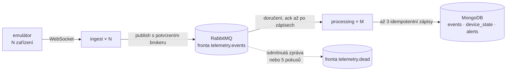

# Škálovatelné zpracování telemetrie zařízení

Emulovaná zařízení posílají telemetrii přes WebSocket. Ingest zprávy ověří a předá do RabbitMQ. Processing je uloží do MongoDB a udržuje aktuální stav každého zařízení. Stav zůstává správný i při duplicitách, zprávách mimo pořadí a více instancích služeb.

Node.js 24, striktní TypeScript, pnpm monorepo, RabbitMQ, MongoDB a Docker Compose.

## Architektura a tok dat



- **Emulátor** udržuje spojení pro každé zařízení a posílá stav, metriky, kumulativní čítače a diagnostiku.
- **Ingest** validuje zprávy a publikuje je s potvrzením brokeru. Neuchovává stav zařízení.
- **Processing** ukládá události, aktuální stav a chybové alerty. Zprávu potvrdí až po zápisech do MongoDB. Nezpracovatelné zprávy jdou do fronty `telemetry.dead`.
- **Sdílený balíček** obsahuje kontrakt zpráv, konfiguraci a logger. Aplikace jsou v `apps/`, sdílený balíček v `packages/shared/`.

## Konzistence

Odpovědi na otázky ze zadání:

- **Metadata zprávy.** Každá zpráva nese identitu `(deviceId, sessionId, seq)`, kterou vytvoří zařízení. `sessionId` je čas startu session v milisekundách. `seq` začíná v každé session od 1 a roste o 1. Znovu odeslaná zpráva má proto stejnou identitu.
- **Aktuální stav a jeho novost.** Dokument zařízení v `device_state` má pro každý typ telemetrie vlastní sekci. Sekce drží hodnoty zprávy s nejvyšším klíčem `(sessionId, seq)`: nejdřív rozhoduje `sessionId`, při shodě `seq`. Čas příchodu ani `occurredAt` o novosti nerozhodují.
- **Atomické operace.** Porovnání klíče a zápis sekce provede MongoDB v jedné podmíněné operaci nad jedním dokumentem. Mezi čtením a zápisem není žádné okno. Starší zpráva proto nepřepíše novější ani při souběhu instancí.
- **Duplicity.** Události mají unikátní index na identitě, alert má `_id` rovné identitě zprávy a čítače nesou absolutní hodnoty. Duplicita tak nevytvoří druhou událost ani druhý alert a nezvýší čítač. Opakovaný zápis má stejný výsledek jako jeden (idempotence).
- **Paralelní zpracování.** Všechny instance processingu čtou jednu společnou frontu. Zprávy se nesměrují podle zařízení a nic se nezamyká. Výsledek neurčuje pořadí zpracování, ale porovnání klíčů při zápisu. Různé instance proto mohou zpracovávat i zprávy stejného zařízení současně bez konfliktu.

## Spuštění

Potřeba: Docker Engine 25+ a Docker Compose 2.20.2+. Node ani pnpm na hostu nejsou pro běh systému nutné.

```bash
docker compose up -d --build --wait
```

Spustí RabbitMQ, MongoDB, ingest, processing a emulátor s 10 zařízeními. Vývojové přihlašovací údaje jsou v `docker-compose.yml`; není potřeba vytvářet `.env`. RabbitMQ management je na <http://localhost:15672>. Logy zobrazí `docker compose logs -f`.

```bash
docker compose down       # zastavení, data zůstanou
docker compose down -v    # zastavení a smazání dat
```

## Více instancí

```bash
docker compose up -d --build --wait --scale ingest=2 --scale processing=3
```

Zařízení při připojení náhodně vybírají adresu ingestu z DNS. Existující spojení se nepřesouvají; na nové instance ingestu je rozdělí `docker compose restart emulator`. Instance processingu čtou společnou frontu; konzistenci zajišťuje MongoDB. Emulátor škálujte počtem zařízení, ne pomocí `--scale emulator`: repliky by měly stejná id zařízení.

Každý další `docker compose up` musí `--scale` zopakovat, jinak vrátí počet instancí na 1.

Ověření škálování (potřebuje jen Node.js 24, bez instalace závislostí):

```bash
node scripts/compose-check.mjs --scale --down
```

Skript stack sám spustí se 2 instancemi ingestu a 3 instancemi processingu. Ověří, že služby jsou zdravé, data dorazila do MongoDB, každá instance processingu má consumera a zařízení jsou připojená ke všem instancím ingestu. Přepínač `--down` stack na konci odstraní **včetně dat**. Pokud v databázi zůstala data z běhu s jiným počtem zařízení, spusťte předtím `docker compose down -v`.

## Konfigurace emulátoru

Proměnné nastavte přes `export` v shellu nebo v `.env`. Proměnná zapsaná přímo před příkazem platí jen pro ten příkaz a další `docker compose up` bez ní vrátí výchozí hodnotu. Neplatná konfigurace ukončí start s chybou.

| Proměnná                     | Výchozí hodnota | Význam                                                                          |
| ---------------------------- | --------------- | ------------------------------------------------------------------------------- |
| `EMULATOR_DEVICE_COUNT`      | `10`            | Počet zařízení.                                                                 |
| `EMULATOR_EVENT_INTERVAL_MS` | `1000`          | Interval metrik jednoho zařízení v ms.                                          |
| `EMULATOR_CHAOS`             | prázdné         | Čárkami oddělené scénáře: `duplicate`, `out-of-order`, `disconnect`, `restart`. |
| `EMULATOR_SEED`              | `1`             | Seed generátoru náhodných čísel.                                                |
| `LOG_LEVEL`                  | `info`          | Úroveň logování všech aplikací.                                                 |

```bash
export EMULATOR_DEVICE_COUNT=200 EMULATOR_EVENT_INTERVAL_MS=500
docker compose up -d --wait
```

Scénáře v `EMULATOR_CHAOS`:

| Scénář         | Co se stane                                                                                                             |
| -------------- | ----------------------------------------------------------------------------------------------------------------------- |
| `duplicate`    | Stejná zpráva odejde dvakrát se stejnou identitou.                                                                      |
| `out-of-order` | Dvě sousední zprávy odejdou v prohozeném pořadí.                                                                        |
| `disconnect`   | Zařízení zavře spojení a znovu se připojí. Session, `seq` i neodeslané zprávy zůstávají.                                |
| `restart`      | Simulovaný restart. Zařízení ztratí neodeslané zprávy a čítače a začne novou session s vyšším `sessionId` a `seq` od 1. |

Další proměnné a výchozí hodnoty jsou v [.env.example](.env.example). Pro změnu dalších voleb emulátoru je přidejte do jeho `environment` v `docker-compose.yml`; Compose je automaticky nepředává.

## Ověření výsledků

Zapněte všechny scénáře. Pokud stack běží škálovaný, přidejte k `up` stejné `--scale`.

```bash
export EMULATOR_CHAOS=duplicate,out-of-order,disconnect,restart
docker compose up -d --wait
```

Během běhu ukáže log processingu, že duplicity a starší zprávy stav nezměnily. `"outcome":"stale"` znamená, že uložený stav byl novější nebo stejný a zpráva ho nezměnila. `"duplicate":true` znamená, že událost už byla uložená.

```bash
docker compose logs processing | grep -E '"outcome":"stale"|"duplicate":true'
```

Výsledný stav v MongoDB ověří skript `scripts/state-check.js`. Potřebuje klidný systém: zastavte emulátor a počkejte, až fronta `telemetry.events` ukáže `messages` 0 ve dvou čteních po sobě s odstupem 10 s. Počty v `rabbitmqctl` se zpožďují až o 5 s.

```bash
docker compose stop emulator
docker compose exec -T rabbitmq rabbitmqctl list_queues --quiet name messages consumers
docker compose exec -T mongodb sh -c 'mongosh --quiet -u "$MONGO_INITDB_ROOT_USERNAME" -p "$MONGO_INITDB_ROOT_PASSWORD" --authenticationDatabase admin telemetry /dev/stdin' < scripts/state-check.js
```

Skript bere přihlašovací údaje z prostředí kontejneru MongoDB. Pro každou kontrolu vypíše `PASS` nebo `FAIL` a při chybě skončí s kódem 1:

- unikátní index brání druhému uložení události se stejnou identitou `(deviceId, sessionId, seq)` a žádná identita není uložená dvakrát,
- každá sekce `device_state` obsahuje hodnoty nejnovější uložené události svého typu,
- každá uložená chybová diagnostika má alert se svou identitou a žádný jiný alert neexistuje.

Stav jednoho zařízení a opětovné spuštění emulátoru:

```bash
docker compose exec -T mongodb sh -c 'mongosh --quiet -u "$MONGO_INITDB_ROOT_USERNAME" -p "$MONGO_INITDB_ROOT_PASSWORD" --authenticationDatabase admin telemetry --eval "db.device_state.findOne({ _id: \"dev-0001\" })"'
docker compose start emulator
```

## Testy

Navíc potřeba: Node.js 24.10+ v řadě 24 a pnpm 10. `corepack enable` zpřístupní verzi pnpm určenou v `package.json`.

```bash
pnpm install --frozen-lockfile
pnpm test                  # unit a integrační testy; potřebuje Docker
pnpm test:unit             # pouze unit testy, bez Dockeru
pnpm test:integration      # pouze integrační testy
pnpm lint && pnpm typecheck && pnpm format:check
```

Integrační testy si spustí skutečný RabbitMQ a MongoDB z `docker-compose.test.yml` a potom je odstraní. Ověřují tok dat, duplicity, zprávy mimo pořadí, souběh instancí a obnovu po výpadcích. Testovací stack je oddělený od vývojového. Ručně spuštěný testovací stack nechají běžet.

CI spouští formátování, lint, typecheck a testy. Ověřovací skript Compose stacku (`scripts/compose-check.mjs`) v CI neběží.

## Známé limity a vědomé kompromisy

- **Zařízení nedostává potvrzení od ingestu.** Pád ingestu, zaplněný outbox nebo restart zařízení mohou ztratit zprávy. Další periodická zpráva stav obnoví; ztracená jednorázová diagnostika znamená chybějící alert.
- **Pořadí session závisí na hodinách zařízení.** Posun hodin zpět mezi restarty může způsobit odmítání nového stavu jako staršího.
- **Zpracování jednoho zařízení není sériové.** Atomické zápisy chrání výsledný stav, ale návrh nepodporuje přírůstkové události ani efekty vyžadující pořadí. Čítače platí pouze pro jednu session.
- **Tři zápisy nejsou společná transakce.** Po pádu může být stav dočasně neúplný; opakované doručení doplní chybějící zápisy. Také řízené zastavení může způsobit opakované doručení bez dalšího efektu.
- **Infrastruktura je vývojová.** Jeden RabbitMQ a standalone MongoDB neposkytují vysokou dostupnost. Chybí TLS, autentizace zařízení, limity spojení a automatický restart kontejnerů. Vývojová hesla jsou v Compose; publikované porty jsou vázané na localhost.
- **Provozní omezení.** Události se ukládají bez časového limitu, dead-letter fronta vyžaduje ruční kontrolu a rozdělení spojení je náhodné. Dopad konzistence na propustnost není změřený.

## Co bych doplnil nebo řešil jinak

Doplnil bych:

1. Potvrzování zpráv zařízení a opakované odeslání nepotvrzených zpráv.
2. TLS, autentizaci zařízení a limity spojení a rychlosti.
3. MongoDB replica set, RabbitMQ cluster a load balancer s kontrolou zdraví ingestu.
4. Benchmark propustnosti, metriky, retenci událostí a zpracování dead-letter fronty.
5. Test SIGTERM skutečnému procesu s rozpracovanými zprávami a ověření Compose stacku v CI.

Jinak bych řešil, až to bude potřeba:

- **Směrování podle zařízení** místo jedné společné fronty: `x-modulus-hash` exchange rozdělí zařízení do více front a každou frontu čte jen jeden consumer (single active consumer). Dává sériové zpracování jednoho zařízení, které potřebují přírůstkové události. Stojí propustnost: zařízení s mnoha zprávami zpomalí ostatní zařízení ve své frontě, počet front omezuje počet consumerů a změna počtu front přeskupí zařízení.
- **Dávkové zápisy** (`bulkWrite`) místo jednoho round tripu do MongoDB na zápis, pokud měření ukáže, že propustnost omezuje databáze.
- **`sessionId` z trvale uloženého čítače** místo hodin zařízení, pokud má zařízení trvalé úložiště. Odstraní to limit s posunem hodin.

Podrobné odůvodnění, alternativy a další kompromisy jsou v [návrhových dokumentech](docs/specs/), zejména v [návrhu konzistence](docs/specs/2026-09-11-telemetry-consistency-design.md).
